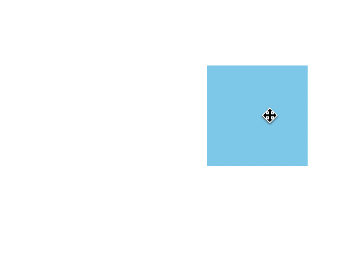
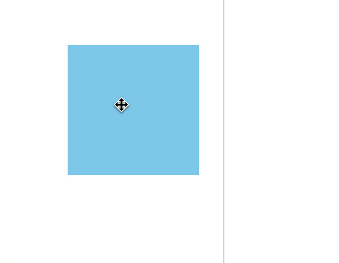
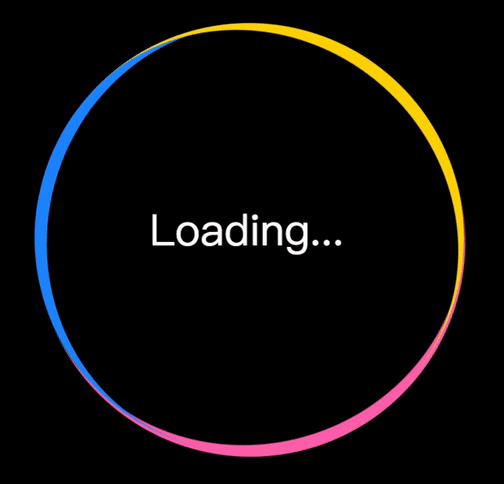
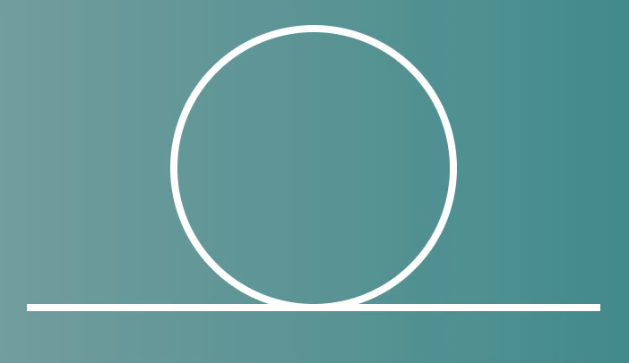
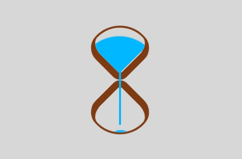

# fe-practices
持续写一些小练习，以保持我的技能不被退化。

### Contents
名称 | 说明 | 附图
---- | ---- | ----
[001-knot](./001-knot) | 自己画的一个中国结，教程：[用css画一个中国结](https://segmentfault.com/a/1190000016306150) | 
[002-simple-drag](./002-drag) | 一个简单的拖拽 | 
[003-simple-drag-resize](./003-drag-resize) | 一个简单的拖拽和缩放 | 
[065-loader](./065-loader) | 一个漂亮的 loading，教程：[前端每日实战：65](https://segmentfault.com/a/1190000015424389) | 
[084-loader](./084-loader) | 一个漂亮的 loading，教程：[前端每日实战：84](https://segmentfault.com/a/1190000015700996) | 
[098-css-pig](./098-dumb-pig) | 用 CSS 创作一只愤怒小鸟中的绿猪，教程：[前端每日实战：98](https://segmentfault.com/a/1190000015909608) | 
[099-loader](./099-loader) | 一个过山车loader，教程：[前端每日实战：99](https://segmentfault.com/a/1190000015924973) | 
[100-neon](./100-neon) | 一个超级漂亮的霓虹效果loader，教程：[前端每日实战：100](https://segmentfault.com/a/1190000015939758) | 
[118-loader](./118-loader) | 一个漏斗效果的loader，教程：[前端每日实战：118](https://segmentfault.com/a/1190000016153878) | 
[122-icon](./122-icon) | 一个苹果手机相册的icon，教程：[前端每日实战：122](https://segmentfault.com/a/1190000016202268) | 